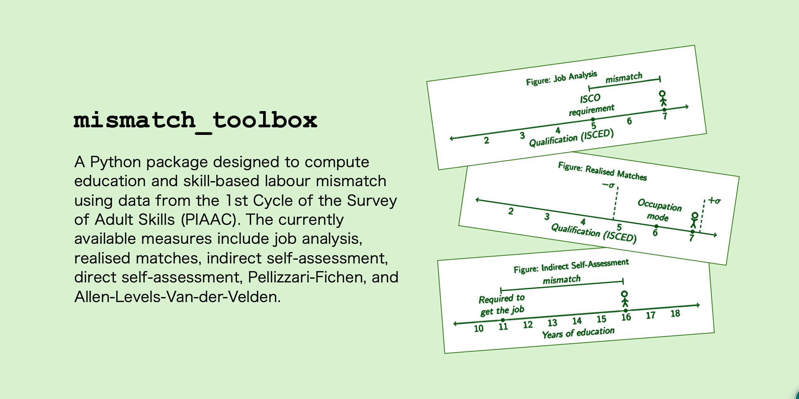
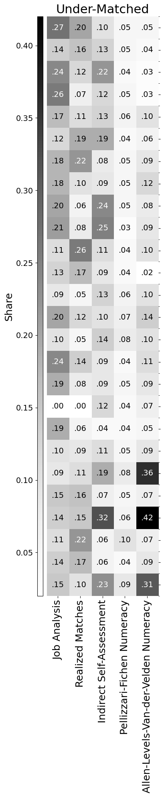
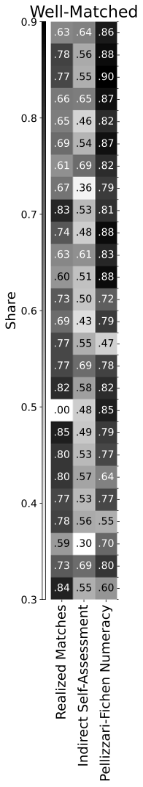
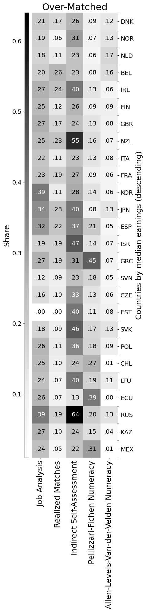
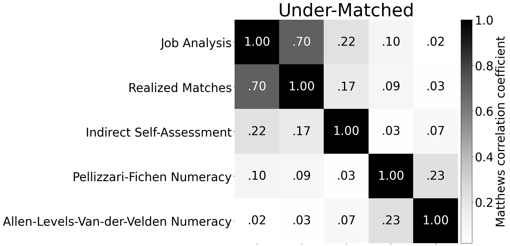

# Labout Mismatch Toolbox for PIAAC

[Usage](#usage) | [Example](#example) | [Functions](#functions) | [Codebook](#codebook) | [References](#references)



This package provides a set of functions designed to compute education 
and skill mismatch using data from the 1st Cycle of the Survey of Adult 
Skills (PIAAC). The currently available measures include job analysis, 
realised matches, indirect self-assessment, direct self-assessment, 
Pellizzari-Fichen [[3]](#3-pellizzari-m--fichen-a-2017-a-new-measure-of-skill-mismatch-theory-and-evidence-from-piaac-iza-journal-of-labor-economics-6-1-30), and Allen-Levels-Van-der-Velden [[1]](#1-allen-j-p-levels-m--van-der-velden-r-k-w-2013-skill-mismatch-and-skill-use-in-developed-countries-evidence-from-the-piaac-study). For the desription 
of the measures, please refer to Section 3: Labour Mismatch Measurement 
Frameworks in [[2]](#2-iakovlev-v-2024-skill-vs-education-types-of-labour-mismatch-and-their-association-with-earnings-no-2024-12-accountancy-economics-and-finance-working-papers).

## Usage

1. Create a new directory with the input data make it your working directory
2. Clone the repository to that directory
3. Make sure the following packages are installed: ``matplotlib``, `numpy` ``pandas``, ``scikit-learn``, ``seaborn``, ``statistics``, ``tabulate``:
```python
pip install matplotlib numpy pandas scikit-learn seaborn statistics tabulate
```
4. Import the package:
```python
import mismatch_toolbox as mt
```
5. Type ``help(mt)`` to view the packages's description and available modules.

## Example

[Importing](#1-import-the-packages) | [Preprocessing](#2-load-and-preprocess-the-data) | [Measures](#3-compute-three-mismatch-measures) | [Shares](#4-calculate-mismatch-shares-across-countries) | [Heatmaps I: shares](#5-plot-shares-heatmap) | [Heatmaps II: correlations](#6-plot-correlation-heatmap)

### 1. Import the packages

```python
import pandas as pd
import os
import sys

sys.path.insert(0, '/Users/bruce/example_directory_with_the_package')
import mismatch_toolbox as mt
```

### 2. Load and preprocess the data

```python
# Preliminaries
sec_name = ""
log_file = pd.DataFrame(columns=['index', 'section', 'record'])

# PIAAC Data
sec_name = 'Load PIAAC Data'
log_file = mt.utilities.section(sec_name, log_file)

# set the directory
os.chdir('/Users/bruce/example_directory_with_the_package')
log_record = 'directory is set to /Users/bruce/example_directory_with_the_package'
log_file = mt.utilities.log(log_file, log_record)

# load PIAAC dataset
log_record = 'loading piaac dataset, please wait'
log_file = mt.utilities.log(log_file, log_record)
piaac = pd.read_csv('/Users/bruce/example_directory_with_piaac_data/piaac.csv', low_memory=False)

# Preparation
sec_name = 'Preparations'
log_file = mt.utilities.section(sec_name, log_file)
piaac, log_file = mt.clean.preparation(piaac, log_file)

# ISCO-08 skill level
sec_name = 'ISCO-08 skill level'
log_file = mt.utilities.section(sec_name, log_file)
piaac, log_file = mt.isco.education(piaac, log_file)

# ISCO-08 occupation groups
sec_name = 'ISCO-08 occupation groups'
log_file = mt.utilities.section(sec_name, log_file)
piaac, log_file = mt.isco.occupations(piaac, log_file)

```

Output:

```
Load PIAAC Data
---------------------------------------------

log[1] directory is set to /Users/seva/Desktop/projects/labour_mismatch/code/python/test
log[2] loading piaac dataset, please wait

Preparations
---------------------------------------------

log[4] converting cntryid to float
log[5] creating [cntryname]: variable for country names
log[6] creating [cntrycode]: variable for country codes
log[7] check and drop for missing values in country ID
log[8] no observations have the value of nan for [cntryid]
log[9] n=227031
log[10] converting [c_d05] (employment status) to float
log[11] drop all respondents who are unemployed or out of the labour force
log[12] n=227031
log[13] dropping observations with [c_d05]!=[1]
log[14] n=150650; 76381 observations have been removed
log[15] creating [earn]: variable earn as a float of an earnings variable of choice
log[16] check and drop for missing values in earnings
log[17] 73937 observations have the value of nan for [earn]
log[18] n=150650
log[19] removing the observations...
log[20] no observations have the value of nan for [earn]
log[21] n=76713; 73937 observations have been removed
log[22] trim earningns at the 1st and 99th percentiles
log[23] n=75188

ISCO-08 skill level
---------------------------------------------

log[25] converting ISCED level to a float
log[26] missing values cleaning skipped for b_q01a
log[27] 4038 observations have the value of nan for b_q01a
log[28] creating a variable for obtained ISCO-08 skill level
log[29] print table of ISCED - skill level mapping

+----------+-------+-------+-------+-------+-------+
| b_q01a   |   1.0 |   2.0 |   3.0 |   4.0 |   All |
|----------+-------+-------+-------+-------+-------|
| 1.0      |  1011 |     0 |     0 |     0 |  1011 |
| 2.0      |     0 |  2101 |     0 |     0 |  2101 |
| 3.0      |     0 |  7418 |     0 |     0 |  7418 |
| 4.0      |     0 |  1681 |     0 |     0 |  1681 |
| 5.0      |     0 |  8974 |     0 |     0 |  8974 |
| 6.0      |     0 | 14414 |     0 |     0 | 14414 |
| 7.0      |     0 |  3607 |     0 |     0 |  3607 |
| 8.0      |     0 |  1306 |     0 |     0 |  1306 |
| 9.0      |     0 |  1266 |     0 |     0 |  1266 |
| 10.0     |     0 |   842 |     0 |     0 |   842 |
| 11.0     |     0 |     0 |  8493 |     0 |  8493 |
| 12.0     |     0 |     0 |     0 | 10351 | 10351 |
| 13.0     |     0 |     0 |     0 |  6950 |  6950 |
| 14.0     |     0 |     0 |     0 |   629 |   629 |
| 15.0     |     0 |     0 |     0 |   565 |   565 |
| 16.0     |     0 |     0 |     0 |  1542 |  1542 |
| All      |  1011 | 41609 |  8493 | 20037 | 71150 |
+----------+-------+-------+-------+-------+-------+
log[30] converting isco08_sl_o to float
log[31] missing values cleaning skipped for isco08_sl_o
log[32] 4038 observations have the value of nan for isco08_sl_o
log[33] convert b_q01c2 (year of finish) to float
log[34] creating a variable for the year when higher education decision was supposedly made
log[35] creating a variable for country specific decision year bins

ISCO-08 occupation groups
---------------------------------------------

log[37] converting isco1c, isco2c, isco1l and isco2l to float
log[38] check and drop for 1-digit occupation groups
log[39] 18 observations have the value of nan for [isco1c]
log[40] n=75188
log[41] removing the observations...
log[42] no observations have the value of nan for [isco1c]
log[43] n=75170; 18 observations have been removed
log[44] check and drop for 2-digit occupation groups
log[45] no observations have the value of nan for [isco2c]
log[46] n=75170
log[47] dropping observations for which isco1c is encoded as missing (9995, 9996, 9997, 9998, 9999)
log[48] n=75170
log[49] dropping observations with [isco1c]==[9995, 9996, 9997, 9998, 9999]
log[50] n=74445; 725 observations have been removed
log[51] creating occupation group label variable for 1-digit groups
log[52] creating occupation group label variable for 2-digit groups
log[53] creating major custom occupation groups based on ISCO-08 required skill level
log[54] check and drop for custom occupation groups
log[55] 493 observations have the value of nan for [isco_lbl]
log[56] n=74445
log[57] removing the observations...
log[58] dropping armed orces due to small sample
log[59] n=73952
log[60] dropping observations with [isco2c]==[1, 2, 3]
log[61] n=73675; 277 observations have been removed
log[62] creating variables for country-specific occupation groups
log[63] dropping occupations groups with n<30
log[64] n=73675
log[65] dropping observations with [cntry_isco_lbl]==['RUS Low skilled managers', 'RUS Skilled agricultural, forestry and fishery workers', 'JPN Low skilled managers', 'JPN Skilled agricultural, forestry and fishery workers', 'CHL Low skilled managers', 'GRC High skilled managers', 'GRC Low skilled managers', 'GRC Skilled agricultural, forestry and fishery workers', 'KAZ Skilled agricultural, forestry and fishery workers', 'ESP Low skilled managers', 'IRL Skilled agricultural, forestry and fishery workers', 'ECU High skilled managers', 'ECU Low skilled managers', 'NLD Skilled agricultural, forestry and fishery workers', 'NOR Low skilled managers', 'NOR Skilled agricultural, forestry and fishery workers', 'POL Skilled agricultural, forestry and fishery workers', 'ISR Skilled agricultural, forestry and fishery workers', 'ITA High skilled managers', 'ITA Skilled agricultural, forestry and fishery workers', 'ITA Low skilled managers', 'KOR Low skilled managers', 'KOR Skilled agricultural, forestry and fishery workers', 'SVN Skilled agricultural, forestry and fishery workers', 'SVN Low skilled managers', 'BEL Low skilled managers', 'BEL Skilled agricultural, forestry and fishery workers', 'MEX Low skilled managers', 'SVK Low skilled managers', 'SVK Skilled agricultural, forestry and fishery workers', 'LTU Low skilled managers', 'LTU Skilled agricultural, forestry and fishery workers', 'CZE Skilled agricultural, forestry and fishery workers', 'GBR Skilled agricultural, forestry and fishery workers']
log[66] n=73135; 540 observations have been removed
```

### 3. Compute mismatch classification using five different measures with selected parameters
- Job Analysis
- Realised Matches with mode ± 1 standard deviation thesholds
- Indirect Self-Assessment with 1 year gap
- Pellizzari-Fichen for numeracy with the thresholds set using regular Direct Skill Assessment and the 5th and 95th percentiles
- Allen-Levels-Van-der-Velden for numeracy with 1.5 z-score thresholds

```python
# Job Analysis
sec_name = 'Job Analysis'
log_file = mt.utilities.section(sec_name, log_file)
piaac, log_file = mt.em.ja(piaac_df = piaac,
                            log_df = log_file)

# Realised Matches - mode
sec_name = 'Realised Matches - mode'
log_file = mt.utilities.section(sec_name, log_file)
piaac, log_file = mt.em.rm_mode(piaac_df = piaac, 
                                SDs = 1, 
                                log_df = log_file)

# Indirect Self-Assessment
sec_name = 'Indirect Self-Assessment'
log_file = mt.utilities.section(sec_name, log_file)
piaac, log_file = mt.em.isa(piaac_df = piaac, 
                            gap = 1, 
                            log_df = log_file)

# Pellizzari-Fichen Numeracy
sec_name = 'Pellizzari-Fichen Numeracy'
log_file = mt.utilities.section(sec_name, log_file)
piaac, log_file = mt.sm.pf(piaac_df = piaac, 
                           skill_var = 'num', 
                           precision = 0.05, 
                           dsa_relaxed = False, 
                           log_df = log_file)

# Allen-Levels-Van-der-Velden Numeracy
sec_name = 'Allen-Levels-Van-der-Velden Numeracy'
log_file = mt.utilities.section(sec_name, log_file)
piaac, log_file = mt.sm.alv(piaac_df = piaac,
                            skill_var = 'num',
                            precision = 1.5,
                            log_df = log_file)
```

Output:

```
Job Analysis
---------------------------------------------

log[68] creating [isco08_sl_r]: variable for required skill level
log[69] creating [ja]: variable for JA mismatch
log[70] missing values cleaning skipped for [ja]
log[71] 3698 observations have the value of nan for ja

Realised Matches - mode
---------------------------------------------

log[73] defining function calculating skill level mode and standard deviation
log[74] calculating country-specific skill level mode and standard deviation
log[75] creating [rm_mode_1]: variable for country-spec mode-based RM mismatch with 1 SDs threshold
log[76] missing values cleaning skipped for [rm_mode_1]
log[77] 3698 observations have the value of nan for rm_mode_1

Indirect Self-Assessment
---------------------------------------------

log[79] converting self-reported requirement to float
log[80] converting years of education to float
log[81] creating [isa_1]: variable for ISA mismatch
log[82] missing values cleaning skipped for [isa_1]
log[83] 2089 observations have the value of nan for isa_1

Pellizzari-Fichen Numeracy
---------------------------------------------

log[85] creating [num]: variable for the average of literacy plausible values
log[86] converting [num] to float
log[87] missing values cleaning skipped for [num]
log[88] 5 observations have the value of nan for [num]
log[89] creating [num] skill mismatch thresholds, [dsa_relaxed] = False
log[90] creating [dsa]
log[91] converting [f_q07a] to float
log[92] check and drop for missing values in [f_q07a]
log[93] 519 observations have the value of nan for [f_q07a]
log[94] n=73135
log[95] removing the observations...
log[96] no observations have the value of nan for [f_q07a]
log[97] n=72616; 519 observations have been removed
log[98] creating variable for being not challenged enough
log[99] converting [f_q07b] to float
log[100] check and drop for missing values in [f_q07b]
log[101] 53 observations have the value of nan for [f_q07b]
log[102] n=72616
log[103] removing the observations...
log[104] no observations have the value of nan for [f_q07b]
log[105] n=72563; 53 observations have been removed
log[106] creating variable for feeling need in training
log[107] creating [dsa]: variable for DSA skill mismatch
log[108] creating [dsa_relaxed]: variable for "relaxed" DSA skill mismatch
log[109] missing values cleaning skipped for [dsa]
log[110] 0 observations have the value of nan for dsa
log[111] missing values cleaning skipped for [dsa_relaxed]
log[112] 0 observations have the value of nan for dsa_relaxed
log[113] creating [dsa_num_min]: cntry_isco_lbl-specific thresholds at 0.05 and 0.95 percentiles
log[114] missing values cleaning skipped for [dsa_num_max]
log[115] 40 observations have the value of nan for dsa_num_max
log[116] missing values cleaning skipped for [dsa_num_min]
log[117] 40 observations have the value of nan for dsa_num_min
log[118] creating [pf_num_005]: variable for literacy skill mismatch
log[119] missing values cleaning skipped for [pf_num_005]
log[120] 42 observations have the value of nan for [pf_num_005]

Allen-Levels-Van-der-Velden Numeracy
---------------------------------------------

log[122] creating [num]: variable for the average of literacy plausible values
log[123] converting [num] to float
log[124] missing values cleaning skipped for [num]
log[125] 2 observations have the value of nan for [num]
log[126] creating [num_zscore] (standardising)
log[127] numeracy numeracy use variables to float
log[128] creating and standardising aggregate numeracy use variables
log[129] creating Allen-Levels-van-der-Velden skill mismatch variable for numeracy
log[130] missing values cleaning skipped for [alv_num_15]
log[131] 56 observations have the value of nan for [alv_num_15]
```

### 4. Calculate mismatch shares across countries

```python
# Shares: Job Analysis
sec_name = 'Shares: Job Analysis'
log_file = mt.utilities.section(sec_name, log_file)
piaac, log_file = mt.utilities.mismatch_shares(piaac_df = piaac, 
                                               mismatch_variable = 'ja', 
                                               feature = 'cntrycode', 
                                               log_df = log_file)

# Shares: Realised Matches
sec_name = 'Shares: Realised Matches'
log_file = mt.utilities.section(sec_name, log_file)
piaac, log_file = mt.utilities.mismatch_shares(piaac_df = piaac, 
                                               mismatch_variable = 'rm_mode_1', 
                                               feature = 'cntrycode', 
                                               log_df = log_file)

# Shares: Indirect Self-Assessment
sec_name = 'Shares: Indirect Self-Assessment'
log_file = mt.utilities.section(sec_name, log_file)
piaac, log_file = mt.utilities.mismatch_shares(piaac_df = piaac, 
                                               mismatch_variable = 'isa_1', 
                                               feature = 'cntrycode', 
                                               log_df = log_file)

# Shares: Pellizzari-Fichen Numeracy
sec_name = 'Shares: Pellizzari-Fichen Numeracy'
log_file = mt.utilities.section(sec_name, log_file)
piaac, log_file = mt.utilities.mismatch_shares(piaac_df = piaac, 
                                               mismatch_variable = 'pf_num_005', 
                                               feature = 'cntrycode', 
                                               log_df = log_file)

# Shares: Allen-Levels-Van-der-Velden Numeracy
sec_name = 'Shares: Allen-Levels-Van-der-Velden Numeracy'
log_file = mt.utilities.section(sec_name, log_file)
piaac, log_file = mt.utilities.mismatch_shares(piaac_df = piaac, 
                                               mismatch_variable = 'alv_num_15', 
                                               feature = 'cntrycode', 
                                               log_df = log_file)

```

Output:

```
Shares: Job Analysis
---------------------------------------------

log[133] creating mismatch shares for [ja] across [cntrycode]
log[134] [ja_wellshare_by_cntrycode] created
log[135] [ja_overshare_by_cntrycode] created
log[136] [ja_undershare_by_cntrycode] created

Shares: Realised Matches
---------------------------------------------

log[138] creating mismatch shares for [rm_mode_1] across [cntrycode]
log[139] [rm_mode_1_wellshare_by_cntrycode] created
log[140] [rm_mode_1_overshare_by_cntrycode] created
log[141] [rm_mode_1_undershare_by_cntrycode] created

Shares: Indirect Self-Assessment
---------------------------------------------

log[143] creating mismatch shares for [isa_1] across [cntrycode]
log[144] [isa_1_wellshare_by_cntrycode] created
log[145] [isa_1_overshare_by_cntrycode] created
log[146] [isa_1_undershare_by_cntrycode] created

Shares: Pellizzari-Fichen Numeracy
---------------------------------------------

log[148] creating mismatch shares for [pf_num_005] across [cntrycode]
log[149] [pf_num_005_wellshare_by_cntrycode] created
log[150] [pf_num_005_overshare_by_cntrycode] created
log[151] [pf_num_005_undershare_by_cntrycode] created

Shares: Allen-Levels-Van-der-Velden Numeracy
---------------------------------------------

log[153] creating mismatch shares for [alv_num_15] across [cntrycode]
log[154] [alv_num_15_wellshare_by_cntrycode] created
log[155] [alv_num_15_overshare_by_cntrycode] created
log[156] [alv_num_15_undershare_by_cntrycode] created
```

### 5. Plot shares heatmap

```python
# Mismatch Shares Heatmap
sec_name = 'Mismatch Shares Heatmap'
log_file = mt.utilities.section(sec_name, log_file)

titles = ['Under-Matched', 'Well-Matched', 'Over-Matched']
sharename = ['undershare', 'wellshare', 'overshare']
x_labels = [True, True, True]
y_labels = [False, False, True]

for i in [0, 1, 2]:
    
    measures = ['ja_'           + sharename[i] + '_by_cntrycode',
                'rm_mode_1_'    + sharename[i] + '_by_cntrycode',
                'isa_1_'        + sharename[i] + '_by_cntrycode',
                'pf_num_005_'   + sharename[i] + '_by_cntrycode',
                'alv_num_15_'  + sharename[i] + '_by_cntrycode']
    
    labels = ['Job Analysis',
              'Realized Matches',
              'Indirect Self-Assessment',
              'Pellizzari-Fichen Numeracy',
              'Allen-Levels-Van-der-Velden Numeracy']
    
    mt.graphs.shares_heatmap(piaac_df = piaac, 
                             measures_list = measures, 
                             measures_labels = labels, 
                             group_var = 'cntrycode', 
                             sort_by = 'earn', 
                             title = titles[i],                             
                             y_labels = y_labels[i], 
                             x_labels = x_labels[i], 
                             colorbar = True, 
                             numbers = True, 
                             nan_present = True,
                             size = (10, 20),
                             vertical = True, 
                             filename = 'test_' + sharename[i] + '_by_cntrycode', 
                             display = True,
                             save = True)
    
    log_record = 'file is saved as ' + 'test_' + sharename[i] + '_by_cntrycode' + '.pdf'
    log_file = mt.utilities.log(log_file, log_record)
```

Output:

```
Mismatch Shares Heatmap
---------------------------------------------
log[158] file is saved as test_undershare_by_cntrycode.pdf
log[159] file is saved as test_wellshare_by_cntrycode.pdf
log[160] file is saved as test_overshare_by_cntrycode.pdf
```

   

### 6. Plot correlation heatmap

```python
# Correlation Heatmap
sec_name = 'Correlation Heatmap'
log_file = mt.utilities.section(sec_name, log_file)

log_record = 'splitiing the mismatch variables into 3 groups'
log_file = mt.utilities.log(log_file, log_record)

measures = ['ja',
            'rm_mode_1',
            'isa_1',
            'pf_num_005',
            'alv_num_15']

piaac, log_record = mt.utilities.mismatch_split(piaac_df = piaac,
                                                measure_list = measures,
                                                log_df = log_file)

measures_u = [x + '_u' for x in measures]

mt.graphs.corr_heat_map(piaac_df = piaac, 
                        corr_type = 'matthews', 
                        measures_list = measures_u, 
                        measures_labels = labels, 
                        country = 'all', 
                        title = "Under-Matched",                     
                        x_labels = False, 
                        y_labels = True,
                        size = (15, 10), 
                        filename = 'mcc_test_u',
                        display = True,
                        save = True)
                        
log_record = 'file is saved as ' + 'mcc_test_u' + '.pdf'
log_file = mt.utilities.log(log_file, log_record)

measures_o = [x + '_o' for x in measures]

mt.graphs.corr_heat_map(piaac_df = piaac, 
                        corr_type = 'matthews', 
                        measures_list = measures_o, 
                        measures_labels = labels, 
                        country = 'all', 
                        title = "Over-Matched",                     
                        x_labels = False, 
                        y_labels = True,
                        size = (15, 10), 
                        filename = 'mcc_test_o',
                        display = True,
                        save = True)

log_record = 'file is saved as ' + 'mcc_test_o' + '.pdf'
log_file = mt.utilities.log(log_file, log_record)
```

Output:

```
Correlation Heatmap
---------------------------------------------

log[162] splitiing the mismatch variables into 3 groups
log[163] splitting [ja] into 3 binary variables
log[164] [ja_u] created
log[165] [ja_w] created
log[166] [ja_o] created
log[167] splitting [rm_mode_1] into 3 binary variables
log[168] [rm_mode_1_u] created
log[169] [rm_mode_1_w] created
log[170] [rm_mode_1_o] created
log[171] splitting [isa_1] into 3 binary variables
log[172] [isa_1_u] created
log[173] [isa_1_w] created
log[174] [isa_1_o] created
log[175] splitting [pf_num_005] into 3 binary variables
log[176] [pf_num_005_u] created
log[177] [pf_num_005_w] created
log[178] [pf_num_005_o] created
log[179] splitting [alv_num_15] into 3 binary variables
log[180] [alv_num_15_u] created
log[181] [alv_num_15_w] created
log[182] [alv_num_15_o] created
log[183] file is saved as mcc_test_u.pdf
log[184] file is saved as mcc_test_o.pdf

```




# Functions

| Module    | Functions                                                                 |  Description |
|-----------|---------------------------------------------------------------------------|--------------|
| `utilities` | [`section`](#utilitiessection)  [`log`](#utilitieslog)  [`print`](#utilitiesprint)  [`mismatch_shares`](#utilitiesmismatch_shares)  [`mismatch_split`](#utilitiesmismatch_split)  [`mcc_matrix`](#utilitiesmcc_matrix) | Assisting data processing and analysis |
| `clean`     | [`drop_nan`](#cleandrop_nan)  [`drop_val`](#cleandrop_val)  [`preparation`](#cleanpreparation) | Data cleaning |
| `isco`      | [`occupations`](#iscooccupations)  [`education`](#iscoeducation) | Cleanomg existing and create additional occupation and education variables based on ISCO-08 |
| `em`        | [`mean_sl`](#emmeansl)  [`mode_sl`](#emmode_sl)  [`rm_mean`](#emrm_mean)  [`rm_mode`](#emrm_mode)  [`ja`](#emja)  [`isa`](#emisa) | Computing education mismatch measures |
| `sm`        | [`dsa`](#smdsa)  [`pf_thresholds`](#smpf_thresholds)  [`pf`](#smpf)  [`alv`](#smalv) | Computing skill mismatch measures |
| `graphs`    | [`format_float`](#graphsformat_float)  [`shares_heatmap`](#graphsshares_heatmap)  [`corr_heat_map`](#graphscorr_heat_map) | Labour mismatch data visualisation |

---

### utilities.section

Create a new section in the log file.

_Parameters:_

**`new_section` : str**, contains new section title.

**`log_df` : pandas.core.frame.DataFrame**, log dataframe with 3 columns ('index', 'section', 'record').

_Returns:_

**`log_df` : pandas.core.frame.DataFrame**, updated log dataframe.

_Description:_

1. Print the `new_section`.
2. Append a record to `log_df` containing `new_section` (new log records will be entered under `new_section` until renewed).
3. Return the updated `log_df`.

---

### utilities.log

Add a new record to the log file.

_Parameters:_

**`log_df` : pandas.core.frame.DataFrame**, log dataframe with 3 columns ('index', 'section', 'record').

**`record` : str**, contains new log record.

_Returns:_

**`log_df` : pandas.core.frame.DataFrame**, updated log dataframe.

_Description:_

1. Print the `record`.
2. Append the `record` to `log_df`.
3. Return the updated `log_df`.

---

### utilities.print

Print a dataframe in a tabular format.

_Parameters:_

**`df` : pandas.core.frame.DataFrame**, any dataframe.

_Returns:_

**`None`**

_Description:_

1. Use the `tabulate` package to print `df` with the following settings:
    * `headers='keys'`
    * `tablefmt='psql'`

---

### utilities.mismatch_shares

Compute mismatch shares within each group.

_Parameters:_

**`piaac_df` : pandas.core.frame.DataFrame**, piaac dataset.

**`mismatch_variable` : str**, mismatch variable name.

**`feature` : str**, group variable.

**`log_df` : pandas.core.frame.DataFrame**, log file.

_Returns:_

**`df` : pandas.core.frame.DataFrame**, piaac dataset with mismatch shares added.

**`log_df` : pandas.core.frame.DataFrame**, updated log file.

_Description:_

1. Compute relative frequencies of each mismatch value (shares) within each group;
2. Create respective mismatch share variables;
3. Register the changes in `log_df`.

---

### utilities.mismatch_split

Split each measure into 3 binary variables.

_Parameters:_

**`piaac_df` : pandas.core.frame.DataFrame**, piaac dataset.

**`measure_list` : list**, list of measures.

**`log_df` : pandas.core.frame.DataFrame**, log file.

_Returns:_

**`piaac_df` : pandas.core.frame.DataFrame**, updated piaac dataset.

**`log_df` : pandas.core.frame.DataFrame**, updated log file.

_Description:_

1. For each measure in `measure_list`:
    * Create 3 binary variables:
        - `[measure]_u`: 1 if undermatched (`[measure] == -1`) and 0 otherwise;
        - `[measure]_w`: 1 if well-matched (`[measure] == 0`) and 0 otherwise;
        - `[measure]_o`: 1 if overmatched (`[measure] == 1`) and 0 otherwise;
    * Register the changes in `log_df`.
2. Return updated `piaac_df` and `log_df`.

---

### utilities.mcc_matrix

Compute Matthew's correlation coefficient matrix.

_Parameters:_

**`df` : pandas.core.frame.DataFrame**, dataset.

**`feature_list` : list**, list of features.

_Returns:_

**`mcc_matrix` : pandas.core.frame.DataFrame**, Matthew's correlation coefficient matrix.

_Description:_

1. For each pair of features in `feature_list`:
    * Compute Matthew's correlation coefficient;
    * Fill the matrix with the computed values;
2. Return the matrix.

---

### clean.drop_nan

Drop observations containing missing values for a given variable.

_Parameters:_

**`df` : pandas.core.frame.DataFrame**, dataset.

**`var` : str**, variable name.

**`log_df` : pandas.core.frame.DataFrame**, log file.

_Returns:_

**`df` : pandas.core.frame.DataFrame**, updated dataset.

**`log_df` : pandas.core.frame.DataFrame**, updated log file.

_Description:_

1. Identify whether the variable is string or numeric;
2. If string: identify observations containing 'nan';
3. If numeric: identify observations containing missing values;
4. Drop observations containing either missing values or 'nan';
5. Repeat the missing values check;
6. Register the changes in `log_df`.

---

### clean.drop_val

Drop observations with specific values for a given variable.

_Parameters:_

**`df` : pandas.core.frame.DataFrame**, dataset.

**`var` : str**, variable name.

**`values_list` : list**, values to be either dropped or kept.

**`operator` : str**, either "==" or "!=".

**`log_df` : pandas.core.frame.DataFrame**, log file.

_Returns:_

**`df` : pandas.core.frame.DataFrame**, updated dataset.

**`log_df` : pandas.core.frame.DataFrame**, updated log file.

_Description:_

For each value in `values_list`:
1. Drop observations that satisfy the following expression: "observation `operator` value";
2. Register the changes in `log_df`.

---

### clean.preparation

Prepare the dataset for analysis.

_Parameters:_

**`piaac_df` : pandas.core.frame.DataFrame**, dataset.

**`log_df` : pandas.core.frame.DataFrame**, log file.

_Returns:_

**`piaac_df` : pandas.core.frame.DataFrame**, updated dataset.

**`log_df` : pandas.core.frame.DataFrame**, updated log file.

_Description:_

1. Convert `cntryid` to float;
2. Create a variable with country names;
3. Create a variable with country codes;
4. Check and drop for missing values in country ID;
5. Identify the respondents who are unemployed or out of the labour force and drop them from the dataset;
6. Create a variable `earn` as a float of `earnhrbonusppp`, drop missing values, and trim at the 1st and 99th percentiles;
7. Register the changes in `log_df`.

---

### isco.occupations

Clean ISCO-08 occupation variables and create custom occupation groups.

_Parameters:_

**`piaac_df` : pandas.core.frame.DataFrame**, PIAAC dataset.

**`log_df` : pandas.core.frame.DataFrame**, log DataFrame.

_Returns:_

**`piaac_df` : pandas.core.frame.DataFrame**, PIAAC dataset with cleaned occupation variables and created custom occupation groups.

**`log_df` : pandas.core.frame.DataFrame**, updated log DataFrame.

_Description:_

1. Convert current job (isco1c, isco2c) and last job (isco1l, isco2l) 1-digit and 2-digit ISCO-08 occupation groups to float.
2. Check and drop missing values for 1-digit and 2-digit occupation groups.
3. Drop observations for which isco1c is encoded as missing (9995, 9996, 9997, 9998, 9999).
4. Create variables isco1c_lbl and isco2c_lbl for isco1c and isco2c labels.
5. Create variable isco_lbl for custom occupation groups based on ISCO-08 required skill level.
6. Check and drop missing values for custom occupation.
7. Drop armed forces due to small sample.
8. Create variables cntry_isco_lbl, cntry_isco1c_lbl, and cntry_isco2c_lbl for country-specific occupation groups.
9. Drop country-specific occupation groups with n<30.

---

### isco.education

Clean education variables and convert ISCED to ISCO-08 skill level.

_Parameters:_

**`piaac_df` : pandas.core.frame.DataFrame**, PIAAC dataset.

**`log_df` : pandas.core.frame.DataFrame**, log DataFrame.

_Returns:_

**`piaac_df` : pandas.core.frame.DataFrame**, PIAAC dataset with cleaned education variables and created ISCO-08 skill level.

**`log_df` : pandas.core.frame.DataFrame**, updated log DataFrame.

_Description:_

1. Convert ISCED (b_q01a) to a float.
2. Count missing values in ISCED.
3. Create skill level variable using specified conditions and values lists.
4. Print table of ISCED - ISCO-08 skill level mapping.
5. Convert obtained ISCO-08 skill level (isco08_sl_o) to float.
6. Count missing values in obtained ISCO-08 skill level.
7. Convert year of finish (b_q01c2) to float.
8. Create a variable for the year when higher education decision was supposedly made.
9. Create a variable for country-specific decision year bins.

---

### em.mean_sl

Calculate mean and standard deviation of skill level for each occupation group.

_Parameters:_

**`piaac_df` : pandas.core.frame.DataFrame**, PIAAC dataset.

**`occ_variable` : str**, occupation variable.

**`mean_name` : str**, name of the mean skill level variable.

**`std_name` : str**, name of the standard deviation variable.

_Returns:_

**`piaac_df` : pandas.core.frame.DataFrame**, updated PIAAC dataset.

_Description:_

1. Loop across occupation groups, compute mean skill level for each group and add the occupation group to the conditions and mean skill level to the values.
2. Create the mean skill level variable.
3. Repeat for standard deviation.

---

### em.mode_sl

Calculate mode and standard deviation of skill level for each occupation group.

_Parameters:_

**`piaac_df` : pandas.core.frame.DataFrame**, PIAAC dataset.

**`occ_variable` : str**, occupation variable.

**`mode_name` : str**, name of the mode skill level variable.

**`std_name` : str**, name of the standard deviation variable.

_Returns:_

**`piaac_df` : pandas.core.frame.DataFrame**, updated PIAAC dataset.

_Description:_

1. Loop across occupation groups, compute mode skill level for each group and add the occupation group to the conditions and mode skill level to the values.
2. Create the mode skill level variable.
3. Repeat for standard deviation.

---

### em.rm_mean

Measure education mismatch using mean-based realised matches.

_Parameters:_

**`piaac_df` : pandas.core.frame.DataFrame**, PIAAC dataset.

**`SDs` : float**, number of standard deviations defining the classification threshold, e.g., if `SDs = 1`, the thresholds are set at -1 and 1 standard deviation from the mean.

**`log_df` : pandas.core.frame.DataFrame**, log DataFrame.

_Returns:_

**`piaac_df` : pandas.core.frame.DataFrame**, updated PIAAC dataset.

**`log_df` : pandas.core.frame.DataFrame**, updated log DataFrame.

_Description:_

1. Calculate country-specific skill level mean and standard deviation.
2. Create variable for country-specific mean-based mismatch.
3. Count missing values in mean-based mismatch.

---

### em.rm_mode

Measure education mismatch using mode-based realised matches.

_Parameters:_

**`piaac_df` : pandas.core.frame.DataFrame**, PIAAC dataset.

**`SDs` : float**, number of standard deviations defining the classification threshold, e.g., if `SDs = 1`, the thresholds are set at -1 and 1 standard deviation from the mode.

**`log_df` : pandas.core.frame.DataFrame**, log DataFrame.

_Returns:_

**`piaac_df` : pandas.core.frame.DataFrame**, updated PIAAC dataset.

**`log_df` : pandas.core.frame.DataFrame**, updated log DataFrame.

_Description:_

1. Calculate country-specific skill level mode and standard deviation.
2. Create variable for country-specific mode-based mismatch.
3. Count missing values in mode-based mismatch.

---

### em.ja

Measure education mismatch using job analysis.

_Parameters:_

**`piaac_df` : pandas.core.frame.DataFrame**, PIAAC dataset.

**`log_df` : pandas.core.frame.DataFrame**, log DataFrame.

_Returns:_

**`piaac_df` : pandas.core.frame.DataFrame**, updated PIAAC dataset.

**`log_df` : pandas.core.frame.DataFrame**, updated log DataFrame.

_Description:_

1. Create variable for required skill level.
2. Create variable for mismatch.
3. Count missing values in JA mismatch.

---

### em.isa

Measure education mismatch using indirect self-assessment.

_Parameters:_

**`piaac_df` : pandas.core.frame.DataFrame**, PIAAC dataset.

**`gap` : float**, allowed gap in years of education to be classified as well-matched.

**`log_df` : pandas.core.frame.DataFrame**, log DataFrame.

_Returns:_

**`piaac_df` : pandas.core.frame.DataFrame**, updated PIAAC dataset.

**`log_df` : pandas.core.frame.DataFrame**, updated log DataFrame.

_Description:_

1. Convert variable 'yrsget' (self-reported required education) to float.
2. Convert variable 'yrsqual' (years of education) to float.
3. Create variable for mismatch.
4. Count missing values in ISA mismatch.

---

### sm.dsa

Measure skill mismatch using direct self-assessment.

_Parameters:_

**`piaac_df` : pandas.core.frame.DataFrame**, PIAAC dataset.

**`log_df` : pandas.core.frame.DataFrame**, log DataFrame.

_Returns:_

**`piaac_df` : pandas.core.frame.DataFrame**, updated PIAAC dataset.

**`log_df` : pandas.core.frame.DataFrame**, updated log DataFrame.

_Description:_

1. Check and drop for missing values in `f_q07a`.
2. Create variable for being not challenged enough (`notchal`).
3. Check and drop for missing values in `f_q07b`.
4. Create variable for feeling need in training (`needtrain`).
5. Create variable for DSA skill mismatch (`dsa`).
6. Create variable for "relaxed" DSA skill mismatch (`dsa_relaxed`).
7. Count missing values in `dsa`.
8. Count missing values in `dsa_relaxed`.

---

### sm.pf_thresholds

Create Pellizzari and Fichen skill mismatch classification thresholds.

_Parameters:_

**`piaac_df` : pandas.core.frame.DataFrame**, PIAAC dataset.

**`occ_variable` : str**, occupation variable.

**`skill_variable` : str**, skill variable.

**`dsa_relaxed` : bool**, relaxed DSA flag. If True, use relaxed DSA instead of regular DSA.

**`l_quantile` : float**, quantile for the lower threshold.

**`h_quantile` : float**, quantile for the higher threshold.

**`log_df` : pandas.core.frame.DataFrame**, log DataFrame.

_Returns:_

**`piaac_df` : pandas.core.frame.DataFrame**, updated PIAAC dataset.

**`log_df` : pandas.core.frame.DataFrame**, updated log DataFrame.

_Description:_

1. For each occupation group, identify the lower quantile in the distribution of skill of the workers who are neither not challenged enough nor feel need in additional training.
2. Append occupation group to the list of conditions.
3. Append the lower quantile to the list of values.
4. Create the variable using conditions and values.
5. For each occupation group, identify the higher quantile in the distribution of skill of the workers who are neither not challenged enough nor feel need in additional training.
6. Append occupation group to the list of conditions.
7. Append the higher quantile to the list of values.
8. Create the variable using conditions and values.
9. Count missing values in mismatch thresholds.

---

### sm.pf

Measure skill mismatch using Pellizzari and Fichen (2017) method.

_Parameters:_

**`piaac_df` : pandas.core.frame.DataFrame**, PIAAC dataset.

**`skill_var` : str**, skill variable.

**`precision` : float**, precision level for the skill mismatch thresholds, e.g., if `precision = 0.1`, the thresholds will be set at the 0.1 and 0.9 quantiles.

**`dsa_relaxed` : bool**, relaxed DSA flag. If True, use relaxed DSA instead of regular DSA.

**`log_df` : pandas.core.frame.DataFrame**, log DataFrame.

_Returns:_

**`piaac_df` : pandas.core.frame.DataFrame**, updated PIAAC dataset.

**`log_df` : pandas.core.frame.DataFrame**, updated log DataFrame.

_Description:_

1. Create variable for the average of plausible values of the skill variable.
2. Convert the skill variable to float, count missing values.
3. Create skill mismatch thresholds using `pf_thresholds()`.
4. Create variable for skill mismatch.
5. Count missing values in skill mismatch.

---

### sm.alv

Measure skill mismatch using Allen et al. (2013) method.

_Parameters:_

**`piaac_df` : pandas.core.frame.DataFrame**, PIAAC dataset.

**`skill_var` : str**, skill variable.

**`precision` : float**, precision level for the skill mismatch thresholds, e.g., if `precision = 1.5`, the thresholds will be set at the 1.5 and -1.5 z-scores.

**`log_df` : pandas.core.frame.DataFrame**, log DataFrame.

_Returns:_

**`piaac_df` : pandas.core.frame.DataFrame**, updated PIAAC dataset.

**`log_df` : pandas.core.frame.DataFrame**, updated log DataFrame.

_Description:_

1. Create variable for the average of plausible values of the skill variable.
2. Convert the skill variable to float, count missing values.
3. Create and standardise aggregate skill use variable.
4. Create Allen-Levels-van-der-Velden skill mismatch variable.
5. Check and drop for missing values in ALV skill mismatch.

---

### graphs.format_float

Convert a float to a string with a specified format.

_Parameters:_

**`fmt` : str**, a format string.

**`val` : float**, a float to be formatted.

_Returns:_

**`str`**, a formatted string.

_Example:_

```python
>>> format_float("%.2f", 3.14159)
"3.14"
>>> format_float("%.2f", -3.14159)
"-3.14"
```

---

### graphs.shares_heatmap

Plot a heatmap of the mismatch shares.

_Parameters:_

**`piaac_df` : pandas.core.frame.DataFrame**, a DataFrame containing the PIAAC data.

**`measures_list` : list**, a list of the mismatch measures variable names.

**`measures_labels` : list**, a list of the labels for the mismatch measures.

**`group_var` : str**, a variable name identifying the group level.

**`sort_by` : str**, a variable name used to sort the mismatch shares.

**`title` : str**, a title of the heatmap.

**`y_labels` : bool**, a boolean indicating whether to display y-axis labels.

**`x_labels` : bool**, a boolean indicating whether to display x-axis labels.

**`colorbar` : bool**, a boolean indicating whether to display a colorbar. Default is True.

**`numbers` : bool**, a boolean indicating whether to display numbers in the heatmap. Default is True.

**`nan_present` : bool**, a boolean indicating whether NaN values are present in the data. Default is True.

**`size` : tuple**, a size of the heatmap. Default is (5, 15).

**`vertical` : bool**, a boolean indicating whether to plot the heatmap vertically. Default is True.

**`filename` : str**, a filename to save the heatmap. Default is 'shares_heatmap'.

**`display` : bool**, a boolean indicating whether to display the plot. Default is True.

**`save` : bool**, a boolean indicating whether to save the plot. Default is True.

_Returns:_

**`plt` : matplotlib.pyplot**, a plot of the heatmap.

_Description:_

1. Create a heatmap of the mismatch shares using the specified parameters.
2. Display and/or save the heatmap based on the `display` and `save` flags.
3. Return the plot object.

---

### graphs.corr_heat_map

Plot a heatmap of the correlation matrix.

_Parameters:_

**`piaac_df` : pandas.core.frame.DataFrame**, a DataFrame containing the PIAAC data.

**`corr_type` : str**, a type of correlation coefficient: 'matthews' or 'pearson'.

**`measures_list` : list**, a list of the mismatch measures variable names.

**`measures_labels` : list**, a list of the labels for the mismatch measures.

**`country` : str**, a country name or 'all'.

**`title` : str**, a title of the heatmap.

**`x_labels` : bool**, a boolean indicating whether to display x-axis labels.

**`y_labels` : bool**, a boolean indicating whether to display y-axis labels.

**`size` : tuple**, a size of the heatmap. Default is (5, 5).

**`filename` : str**, a filename to save the heatmap. Default is 'corr_heatmap'.

**`display` : bool**, a boolean indicating whether to display the plot. Default is True.

**`save` : bool**, a boolean indicating whether to save the plot. Default is True.

_Returns:_

**`plt` : matplotlib.pyplot**, a plot of the heatmap.

_Description:_

1. Compute the correlation matrix using the specified correlation type.
2. Create a heatmap of the correlation matrix using the specified parameters.
3. Display and/or save the heatmap based on the `display` and `save` flags.
4. Return the plot object.

# Codebook

[International](https://www.oecd.org/content/dam/oecd/en/about/programmes/edu/piaac/data-materials/International-Codebook-PIAAC-Public-use-File-Variables-and-Values_Feb2023.xlsx) and [derived variables](https://www.oecd.org/content/dam/oecd/en/about/programmes/edu/piaac/data-materials/Codebook-for-derived-Variables-16March2015.docx) [cedobooks](https://www.oecd.org/en/data/datasets/piaac-1st-cycle-database.html#codebooks) are available at the PIAAC [website](https://www.oecd.org/en/about/programmes/piaac/piaac-data.html).
    

The variables generated by the package are listed below:

| Module | Function | Variable | Description |
| --- | --- | --- | --- |
| `utilities` | `mismatch_shares` | [mismatch_variable]\_wellshare_by_[feature] | well-matched share within each group |
| `utilities` | `mismatch_shares` | [mismatch_variable]\_overshare_by_[feature] | over-matched share within each group |
| `utilities` | `mismatch_shares` | [mismatch_variable]\_undershare_by_[feature] | under-matched share within each group |
| `utilities` | `mismatch_shares` | [mismatch_variable]\_errorshare_by_[feature] | error share within each group (only for dsa) |
| `utilities` | `mismatch_split` | [measure]_u | under-matched binary indicator |
| `utilities` | `mismatch_split` | [measure]_w | well-matched binary indicator |
| `utilities` | `mismatch_split` | [measure]_o | over-matched binary indicator |
| `clean` | `preparation` | cntryname | country names based on the country ID (cntryid) |
| `clean` | `preparation` | earn | earnings based on hourly earnings including bonuses in PPP-corrected USD (earnhrbonusppp) and trimmed at the 1st and 99th percentiles |
| `em` | `ja` | ja | job analysis |
| `em` | `rm_mode` | rm_mode_[SDs] | realised matches with mode ± [SDs] standard deviations thresholds |
| `em` | `rm_mean` | rm_mean_[SDs] | realised matches with mean ± [SDs] standard deviations thresholds |
| `em` | `isa` | isa_[gap] | indirect self-assessment with [gap] year(s) gap |
| `sm` | `dsa` | dsa | direct self-assessment |
| `sm` | `dsa` | dsa_relaxed | relaxed direct self-assessment |
| `sm` | `pf` | pf_[skill_var]_[precision] | Pellizzari-Fichen for [skill_var] with the thresholds set using regular Direct Skill Assessment and the [precision] percentiles |
| `sm` | `pf` | pf_[skill_var]_[precision]_relaxed | Pellizzari-Fichen for [skill_var] with the thresholds set using relaxed Direct Skill Assessment and the [precision] percentiles |
| `sm` | `alv` | alv_[skill_var]_[precision] | Allen-Levels-Van-der-Velden for [skill_var] with [precision] z-score thresholds |

## References

### [1] Allen, J. P., Levels, M., & Van der Velden, R. K. W. (2013). Skill mismatch and skill use in developed countries: Evidence from the PIAAC study.

### [2] Iakovlev, V. (2024). Skill vs. education types of labour mismatch and their association with earnings (No. 2024-12). Accountancy, Economics, and Finance Working Papers.

### [3] Pellizzari, M., & Fichen, A. (2017). A new measure of skill mismatch: theory and evidence from PIAAC. IZA Journal of Labor Economics, 6, 1-30.