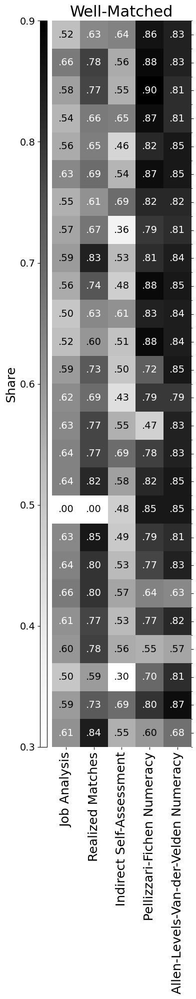

# Labout Mismatch Toolbox for PIAAC

[Usage](#usage) | [Codebook](#codebook) | [Example](#example) | [References](#references)


This package provides a set of functions designed to compute education 
and skill mismatch using data from the 1st Cycle of the Survey of Adult 
Skills (PIAAC). The currently available measures include job analysis, 
realised matches, indirect self-assessment, direct self-assessment, 
Pellizzari and Fichen (2017), and Allen et al. (2013). For the desription 
of the measures, please refer to Section 3: Labour Mismatch Measurement 
Frameworks in [1].

## Usage

1. Create a new directory with the input data make it your working directory
2. Clone the repository to that directory
3. Make sure the following packages are installed: ``matplotlib``, `numpy` ``pandas``, ``scikit-learn``, ``seaborn``, ``statistics``, ``tabulate``:
```python
pip install matplotlib numpy pandas scikit-learn seaborn statistics tabulate
```
4. Import the package:
```python
import mismatch_toolbox as mt
```
5. Type ``help(mt)`` to view the packages's description and available modules.

## Codebook

[International](https://www.oecd.org/content/dam/oecd/en/about/programmes/edu/piaac/data-materials/International-Codebook-PIAAC-Public-use-File-Variables-and-Values_Feb2023.xlsx) and [derived variables](https://www.oecd.org/content/dam/oecd/en/about/programmes/edu/piaac/data-materials/Codebook-for-derived-Variables-16March2015.docx) [cedobooks](https://www.oecd.org/en/data/datasets/piaac-1st-cycle-database.html#codebooks) are available at the PIAAC [website](https://www.oecd.org/en/about/programmes/piaac/piaac-data.html).
    

The variables generated by the package are listed below:

| Module | Function | Variable | Description |
| --- | --- | --- | --- |
| utilities | mismatch_shares | [mismatch_variable] + '_wellshare_by_' + [feature] | well-matched share within each group |
| utilities | mismatch_shares | [mismatch_variable] + '_overshare_by_' + [feature] | over-matched share within each group |
| utilities | mismatch_shares | [mismatch_variable] + '_undershare_by_' + [feature] | under-matched share within each group |
| utilities | mismatch_shares | [mismatch_variable] + '_errorshare_by_' + [feature] | error share within each group (only for dsa) |
| utilities | mismatch_split | [measure] + '_u' | under-matched binary indicator |
| utilities | mismatch_split | [measure] + '_w' | well-matched binary indicator |
| utilities | mismatch_split | [measure] + '_o' | over-matched binary indicator |
| clean | preparation | cntryname | country names based on the country ID (cntryid) |
| clean | preparation | earn | earnings based on hourly earnings including bonuses in PPP-corrected USD (earnhrbonusppp) and trimmed at the 1st and 99th percentiles |

## Example

[Importing](#1-import-the-packages) | [Preprocessing](#2-load-and-preprocess-the-data) | [Measures](#3-compute-three-mismatch-measures) | [Shares](#4-calculate-mismatch-shares-across-countries) | [Heatmaps I: shares](#5-plot-shares-heatmap) | [Heatmaps II: correlations](#6-plot-correlation-heatmap)

### 1. Import the packages

```python
import pandas as pd
import os
import sys

sys.path.insert(0, '/Users/bruce/example_directory_with_the_package')
import mismatch_toolbox as mt
```

### 2. Load and preprocess the data

```python
# Preliminaries
sec_name = ""
log_file = pd.DataFrame(columns=['index', 'section', 'record'])

# PIAAC Data
sec_name = 'Load PIAAC Data'
log_file = mt.utilities.section(sec_name, log_file)

# set the directory
os.chdir('/Users/bruce/example_directory_with_the_package')
log_record = 'directory is set to /Users/bruce/example_directory_with_the_package'
log_file = mt.utilities.log(log_file, log_record)

# load PIAAC dataset
log_record = 'loading piaac dataset, please wait'
log_file = mt.utilities.log(log_file, log_record)
piaac = pd.read_csv('/Users/bruce/example_directory_with_piaac_data/piaac.csv', low_memory=False)

# Preparation
sec_name = 'Preparations'
log_file = mt.utilities.section(sec_name, log_file)
piaac, log_file = mt.clean.preparation(piaac, log_file)

# ISCO-08 skill level
sec_name = 'ISCO-08 skill level'
log_file = mt.utilities.section(sec_name, log_file)
piaac, log_file = mt.isco.education(piaac, log_file)

# ISCO-08 occupation groups
sec_name = 'ISCO-08 occupation groups'
log_file = mt.utilities.section(sec_name, log_file)
piaac, log_file = mt.isco.occupations(piaac, log_file)

```

Output:

```
Load PIAAC Data
---------------------------------------------

log[1] directory is set to /Users/seva/Desktop/projects/labour_mismatch/code/python/test
log[2] loading piaac dataset, please wait

Preparations
---------------------------------------------

log[4] converting cntryid to float
log[5] creating [cntryname]: variable for country names
log[6] creating [cntrycode]: variable for country codes
log[7] check and drop for missing values in country ID
log[8] no observations have the value of nan for [cntryid]
log[9] n=227031
log[10] converting [c_d05] (employment status) to float
log[11] drop all respondents who are unemployed or out of the labour force
log[12] n=227031
log[13] dropping observations with [c_d05]!=[1]
log[14] n=150650; 76381 observations have been removed
log[15] creating [earn]: variable earn as a float of an earnings variable of choice
log[16] check and drop for missing values in earnings
log[17] 73937 observations have the value of nan for [earn]
log[18] n=150650
log[19] removing the observations...
log[20] no observations have the value of nan for [earn]
log[21] n=76713; 73937 observations have been removed
log[22] trim earningns at the 1st and 99th percentiles
log[23] n=75188

ISCO-08 skill level
---------------------------------------------

log[25] converting ISCED level to a float
log[26] missing values cleaning skipped for b_q01a
log[27] 4038 observations have the value of nan for b_q01a
log[28] creating a variable for obtained ISCO-08 skill level
log[29] print table of ISCED - skill level mapping

+----------+-------+-------+-------+-------+-------+
| b_q01a   |   1.0 |   2.0 |   3.0 |   4.0 |   All |
|----------+-------+-------+-------+-------+-------|
| 1.0      |  1011 |     0 |     0 |     0 |  1011 |
| 2.0      |     0 |  2101 |     0 |     0 |  2101 |
| 3.0      |     0 |  7418 |     0 |     0 |  7418 |
| 4.0      |     0 |  1681 |     0 |     0 |  1681 |
| 5.0      |     0 |  8974 |     0 |     0 |  8974 |
| 6.0      |     0 | 14414 |     0 |     0 | 14414 |
| 7.0      |     0 |  3607 |     0 |     0 |  3607 |
| 8.0      |     0 |  1306 |     0 |     0 |  1306 |
| 9.0      |     0 |  1266 |     0 |     0 |  1266 |
| 10.0     |     0 |   842 |     0 |     0 |   842 |
| 11.0     |     0 |     0 |  8493 |     0 |  8493 |
| 12.0     |     0 |     0 |     0 | 10351 | 10351 |
| 13.0     |     0 |     0 |     0 |  6950 |  6950 |
| 14.0     |     0 |     0 |     0 |   629 |   629 |
| 15.0     |     0 |     0 |     0 |   565 |   565 |
| 16.0     |     0 |     0 |     0 |  1542 |  1542 |
| All      |  1011 | 41609 |  8493 | 20037 | 71150 |
+----------+-------+-------+-------+-------+-------+
log[30] converting isco08_sl_o to float
log[31] missing values cleaning skipped for isco08_sl_o
log[32] 4038 observations have the value of nan for isco08_sl_o
log[33] convert b_q01c2 (year of finish) to float
log[34] creating a variable for the year when higher education decision was supposedly made
log[35] creating a variable for country specific decision year bins

ISCO-08 occupation groups
---------------------------------------------

log[37] converting isco1c, isco2c, isco1l and isco2l to float
log[38] check and drop for 1-digit occupation groups
log[39] 18 observations have the value of nan for [isco1c]
log[40] n=75188
log[41] removing the observations...
log[42] no observations have the value of nan for [isco1c]
log[43] n=75170; 18 observations have been removed
log[44] check and drop for 2-digit occupation groups
log[45] no observations have the value of nan for [isco2c]
log[46] n=75170
log[47] dropping observations for which isco1c is encoded as missing (9995, 9996, 9997, 9998, 9999)
log[48] n=75170
log[49] dropping observations with [isco1c]==[9995, 9996, 9997, 9998, 9999]
log[50] n=74445; 725 observations have been removed
log[51] creating occupation group label variable for 1-digit groups
log[52] creating occupation group label variable for 2-digit groups
log[53] creating major custom occupation groups based on ISCO-08 required skill level
log[54] check and drop for custom occupation groups
log[55] 493 observations have the value of nan for [isco_lbl]
log[56] n=74445
log[57] removing the observations...
log[58] dropping armed orces due to small sample
log[59] n=73952
log[60] dropping observations with [isco2c]==[1, 2, 3]
log[61] n=73675; 277 observations have been removed
log[62] creating variables for country-specific occupation groups
log[63] dropping occupations groups with n<30
log[64] n=73675
log[65] dropping observations with [cntry_isco_lbl]==['RUS Low skilled managers', 'RUS Skilled agricultural, forestry and fishery workers', 'JPN Low skilled managers', 'JPN Skilled agricultural, forestry and fishery workers', 'CHL Low skilled managers', 'GRC High skilled managers', 'GRC Low skilled managers', 'GRC Skilled agricultural, forestry and fishery workers', 'KAZ Skilled agricultural, forestry and fishery workers', 'ESP Low skilled managers', 'IRL Skilled agricultural, forestry and fishery workers', 'ECU High skilled managers', 'ECU Low skilled managers', 'NLD Skilled agricultural, forestry and fishery workers', 'NOR Low skilled managers', 'NOR Skilled agricultural, forestry and fishery workers', 'POL Skilled agricultural, forestry and fishery workers', 'ISR Skilled agricultural, forestry and fishery workers', 'ITA High skilled managers', 'ITA Skilled agricultural, forestry and fishery workers', 'ITA Low skilled managers', 'KOR Low skilled managers', 'KOR Skilled agricultural, forestry and fishery workers', 'SVN Skilled agricultural, forestry and fishery workers', 'SVN Low skilled managers', 'BEL Low skilled managers', 'BEL Skilled agricultural, forestry and fishery workers', 'MEX Low skilled managers', 'SVK Low skilled managers', 'SVK Skilled agricultural, forestry and fishery workers', 'LTU Low skilled managers', 'LTU Skilled agricultural, forestry and fishery workers', 'CZE Skilled agricultural, forestry and fishery workers', 'GBR Skilled agricultural, forestry and fishery workers']
log[66] n=73135; 540 observations have been removed
```

### 3. Compute mismatch classification using five different measures with selected parameters
- Job Analysis
- Realised Matches with mode ± 1 standard deviation thesholds
- Indirect Self-Assessment with 1 year gap
- Pellizzari-Fichen for numeracy with the thresholds set using regular Direct Skill Assessment and the 5th and 95th percentiles
- Allen-Levels-Van-der-Velden for numeracy with 1.5 z-score thresholds

```python
# Job Analysis
sec_name = 'Job Analysis'
log_file = mt.utilities.section(sec_name, log_file)
piaac, log_file = mt.em.ja(piaac_df = piaac,
                            log_df = log_file)

# Realised Matches - mode
sec_name = 'Realised Matches - mode'
log_file = mt.utilities.section(sec_name, log_file)
piaac, log_file = mt.em.rm_mode(piaac_df = piaac, 
                                SDs = 1, 
                                log_df = log_file)

# Indirect Self-Assessment
sec_name = 'Indirect Self-Assessment'
log_file = mt.utilities.section(sec_name, log_file)
piaac, log_file = mt.em.isa(piaac_df = piaac, 
                            gap = 1, 
                            log_df = log_file)

# Pellizzari-Fichen Numeracy
sec_name = 'Pellizzari-Fichen Numeracy'
log_file = mt.utilities.section(sec_name, log_file)
piaac, log_file = mt.sm.pf(piaac_df = piaac, 
                           skill_var = 'num', 
                           precision = 0.05, 
                           dsa_relaxed = False, 
                           log_df = log_file)

# Allen-Levels-Van-der-Velden Numeracy
sec_name = 'Allen-Levels-Van-der-Velden Numeracy'
log_file = mt.utilities.section(sec_name, log_file)
piaac, log_file = mt.sm.alv(piaac_df = piaac,
                            skill_var = 'num',
                            precision = 1.5,
                            log_df = log_file)
```

Output:

```
Job Analysis
---------------------------------------------

log[68] creating [isco08_sl_r]: variable for required skill level
log[69] creating [ja]: variable for JA mismatch
log[70] missing values cleaning skipped for [ja]
log[71] 3698 observations have the value of nan for ja

Realised Matches - mode
---------------------------------------------

log[73] defining function calculating skill level mode and standard deviation
log[74] calculating country-specific skill level mode and standard deviation
log[75] creating [rm_mode_1]: variable for country-spec mode-based RM mismatch with 1 SDs threshold
log[76] missing values cleaning skipped for [rm_mode_1]
log[77] 3698 observations have the value of nan for rm_mode_1

Indirect Self-Assessment
---------------------------------------------

log[79] converting self-reported requirement to float
log[80] converting years of education to float
log[81] creating [isa_1]: variable for ISA mismatch
log[82] missing values cleaning skipped for [isa_1]
log[83] 2089 observations have the value of nan for isa_1

Pellizzari-Fichen Numeracy
---------------------------------------------

log[85] creating [num]: variable for the average of literacy plausible values
log[86] converting [num] to float
log[87] missing values cleaning skipped for [num]
log[88] 5 observations have the value of nan for [num]
log[89] creating [num] skill mismatch thresholds, [dsa_relaxed] = False
log[90] creating [dsa]
log[91] converting [f_q07a] to float
log[92] check and drop for missing values in [f_q07a]
log[93] 519 observations have the value of nan for [f_q07a]
log[94] n=73135
log[95] removing the observations...
log[96] no observations have the value of nan for [f_q07a]
log[97] n=72616; 519 observations have been removed
log[98] creating variable for being not challenged enough
log[99] converting [f_q07b] to float
log[100] check and drop for missing values in [f_q07b]
log[101] 53 observations have the value of nan for [f_q07b]
log[102] n=72616
log[103] removing the observations...
log[104] no observations have the value of nan for [f_q07b]
log[105] n=72563; 53 observations have been removed
log[106] creating variable for feeling need in training
log[107] creating [dsa]: variable for DSA skill mismatch
log[108] creating [dsa_relaxed]: variable for "relaxed" DSA skill mismatch
log[109] missing values cleaning skipped for [dsa]
log[110] 0 observations have the value of nan for dsa
log[111] missing values cleaning skipped for [dsa_relaxed]
log[112] 0 observations have the value of nan for dsa_relaxed
log[113] creating [dsa_num_min]: cntry_isco_lbl-specific thresholds at 0.05 and 0.95 percentiles
log[114] missing values cleaning skipped for [dsa_num_max]
log[115] 40 observations have the value of nan for dsa_num_max
log[116] missing values cleaning skipped for [dsa_num_min]
log[117] 40 observations have the value of nan for dsa_num_min
log[118] creating [pf_num_005]: variable for literacy skill mismatch
log[119] missing values cleaning skipped for [pf_num_005]
log[120] 42 observations have the value of nan for [pf_num_005]

Allen-Levels-Van-der-Velden Numeracy
---------------------------------------------

log[122] creating [num]: variable for the average of literacy plausible values
log[123] converting [num] to float
log[124] missing values cleaning skipped for [num]
log[125] 2 observations have the value of nan for [num]
log[126] creating [num_zscore] (standardising)
log[127] numeracy numeracy use variables to float
log[128] creating and standardising aggregate numeracy use variables
log[129] creating Allen-Levels-van-der-Velden skill mismatch variable for numeracy
log[130] missing values cleaning skipped for [alv_num_15]
log[131] 56 observations have the value of nan for [alv_num_15]
```

### 4. Calculate mismatch shares across countries

```python
# Shares: Job Analysis
sec_name = 'Shares: Job Analysis'
log_file = mt.utilities.section(sec_name, log_file)
piaac, log_file = mt.utilities.mismatch_shares(piaac_df = piaac, 
                                               mismatch_variable = 'ja', 
                                               feature = 'cntrycode', 
                                               log_df = log_file)

# Shares: Realised Matches
sec_name = 'Shares: Realised Matches'
log_file = mt.utilities.section(sec_name, log_file)
piaac, log_file = mt.utilities.mismatch_shares(piaac_df = piaac, 
                                               mismatch_variable = 'rm_mode_1', 
                                               feature = 'cntrycode', 
                                               log_df = log_file)

# Shares: Indirect Self-Assessment
sec_name = 'Shares: Indirect Self-Assessment'
log_file = mt.utilities.section(sec_name, log_file)
piaac, log_file = mt.utilities.mismatch_shares(piaac_df = piaac, 
                                               mismatch_variable = 'isa_1', 
                                               feature = 'cntrycode', 
                                               log_df = log_file)

# Shares: Pellizzari-Fichen Numeracy
sec_name = 'Shares: Pellizzari-Fichen Numeracy'
log_file = mt.utilities.section(sec_name, log_file)
piaac, log_file = mt.utilities.mismatch_shares(piaac_df = piaac, 
                                               mismatch_variable = 'pf_num_005', 
                                               feature = 'cntrycode', 
                                               log_df = log_file)

# Shares: Allen-Levels-Van-der-Velden Numeracy
sec_name = 'Shares: Allen-Levels-Van-der-Velden Numeracy'
log_file = mt.utilities.section(sec_name, log_file)
piaac, log_file = mt.utilities.mismatch_shares(piaac_df = piaac, 
                                               mismatch_variable = 'alv_num_15', 
                                               feature = 'cntrycode', 
                                               log_df = log_file)

```

Output:

```
Shares: Job Analysis
---------------------------------------------

log[133] creating mismatch shares for [ja] across [cntrycode]
log[134] [ja_wellshare_by_cntrycode] created
log[135] [ja_overshare_by_cntrycode] created
log[136] [ja_undershare_by_cntrycode] created

Shares: Realised Matches
---------------------------------------------

log[138] creating mismatch shares for [rm_mode_1] across [cntrycode]
log[139] [rm_mode_1_wellshare_by_cntrycode] created
log[140] [rm_mode_1_overshare_by_cntrycode] created
log[141] [rm_mode_1_undershare_by_cntrycode] created

Shares: Indirect Self-Assessment
---------------------------------------------

log[143] creating mismatch shares for [isa_1] across [cntrycode]
log[144] [isa_1_wellshare_by_cntrycode] created
log[145] [isa_1_overshare_by_cntrycode] created
log[146] [isa_1_undershare_by_cntrycode] created

Shares: Pellizzari-Fichen Numeracy
---------------------------------------------

log[148] creating mismatch shares for [pf_num_005] across [cntrycode]
log[149] [pf_num_005_wellshare_by_cntrycode] created
log[150] [pf_num_005_overshare_by_cntrycode] created
log[151] [pf_num_005_undershare_by_cntrycode] created

Shares: Allen-Levels-Van-der-Velden Numeracy
---------------------------------------------

log[153] creating mismatch shares for [alv_num_15] across [cntrycode]
log[154] [alv_num_15_wellshare_by_cntrycode] created
log[155] [alv_num_15_overshare_by_cntrycode] created
log[156] [alv_num_15_undershare_by_cntrycode] created
```

### 5. Plot shares heatmap

```python
# Mismatch Shares Heatmap
sec_name = 'Mismatch Shares Heatmap'
log_file = mt.utilities.section(sec_name, log_file)

titles = ['Under-Matched', 'Well-Matched', 'Over-Matched']
sharename = ['undershare', 'wellshare', 'overshare']
x_labels = [True, True, True]
y_labels = [False, False, True]

for i in [0, 1, 2]:
    
    measures = ['ja_'           + sharename[i] + '_by_cntrycode',
                'rm_mode_1_'    + sharename[i] + '_by_cntrycode',
                'isa_1_'        + sharename[i] + '_by_cntrycode',
                'pf_num_005_'   + sharename[i] + '_by_cntrycode',
                'alv_num_15_'  + sharename[i] + '_by_cntrycode']
    
    labels = ['Job Analysis',
              'Realized Matches',
              'Indirect Self-Assessment',
              'Pellizzari-Fichen Numeracy',
              'Allen-Levels-Van-der-Velden Numeracy']
    
    mt.graphs.shares_heatmap(piaac_df = piaac, 
                             measures_list = measures, 
                             measures_labels = labels, 
                             group_var = 'cntrycode', 
                             sort_by = 'earn', 
                             title = titles[i],                             
                             y_labels = y_labels[i], 
                             x_labels = x_labels[i], 
                             colorbar = True, 
                             numbers = True, 
                             nan_present = True,
                             size = (10, 20),
                             vertical = True, 
                             filename = 'test_' + sharename[i] + '_by_cntrycode', 
                             display = True,
                             save = True)
    
    log_record = 'file is saved as ' + 'test_' + sharename[i] + '_by_cntrycode' + '.pdf'
    log_file = mt.utilities.log(log_file, log_record)
```

Output:

```
Mismatch Shares Heatmap
---------------------------------------------
log[158] file is saved as test_undershare_by_cntrycode.pdf
log[159] file is saved as test_wellshare_by_cntrycode.pdf
log[160] file is saved as test_overshare_by_cntrycode.pdf
```

   

### 6. Plot correlation heatmap

```python
# Correlation Heatmap
sec_name = 'Correlation Heatmap'
log_file = mt.utilities.section(sec_name, log_file)

log_record = 'splitiing the mismatch variables into 3 groups'
log_file = mt.utilities.log(log_file, log_record)

measures = ['ja',
            'rm_mode_1',
            'isa_1',
            'pf_num_005',
            'alv_num_15']

piaac, log_record = mt.utilities.mismatch_split(piaac_df = piaac,
                                                measure_list = measures,
                                                log_df = log_file)

measures_u = [x + '_u' for x in measures]

mt.graphs.corr_heat_map(piaac_df = piaac, 
                        corr_type = 'matthews', 
                        measures_list = measures_u, 
                        measures_labels = labels, 
                        country = 'all', 
                        title = "Under-Matched",                     
                        x_labels = False, 
                        y_labels = True,
                        size = (15, 10), 
                        filename = 'mcc_test_u',
                        display = True,
                        save = True)
                        
log_record = 'file is saved as ' + 'mcc_test_u' + '.pdf'
log_file = mt.utilities.log(log_file, log_record)

measures_o = [x + '_o' for x in measures]

mt.graphs.corr_heat_map(piaac_df = piaac, 
                        corr_type = 'matthews', 
                        measures_list = measures_o, 
                        measures_labels = labels, 
                        country = 'all', 
                        title = "Over-Matched",                     
                        x_labels = False, 
                        y_labels = True,
                        size = (15, 10), 
                        filename = 'mcc_test_o',
                        display = True,
                        save = True)

log_record = 'file is saved as ' + 'mcc_test_o' + '.pdf'
log_file = mt.utilities.log(log_file, log_record)
```

Output:

```
Correlation Heatmap
---------------------------------------------

log[162] splitiing the mismatch variables into 3 groups
log[163] splitting [ja] into 3 binary variables
log[164] [ja_u] created
log[165] [ja_w] created
log[166] [ja_o] created
log[167] splitting [rm_mode_1] into 3 binary variables
log[168] [rm_mode_1_u] created
log[169] [rm_mode_1_w] created
log[170] [rm_mode_1_o] created
log[171] splitting [isa_1] into 3 binary variables
log[172] [isa_1_u] created
log[173] [isa_1_w] created
log[174] [isa_1_o] created
log[175] splitting [pf_num_005] into 3 binary variables
log[176] [pf_num_005_u] created
log[177] [pf_num_005_w] created
log[178] [pf_num_005_o] created
log[179] splitting [alv_num_15] into 3 binary variables
log[180] [alv_num_15_u] created
log[181] [alv_num_15_w] created
log[182] [alv_num_15_o] created
log[183] file is saved as mcc_test_u.pdf
log[184] file is saved as mcc_test_o.pdf

```


## References
